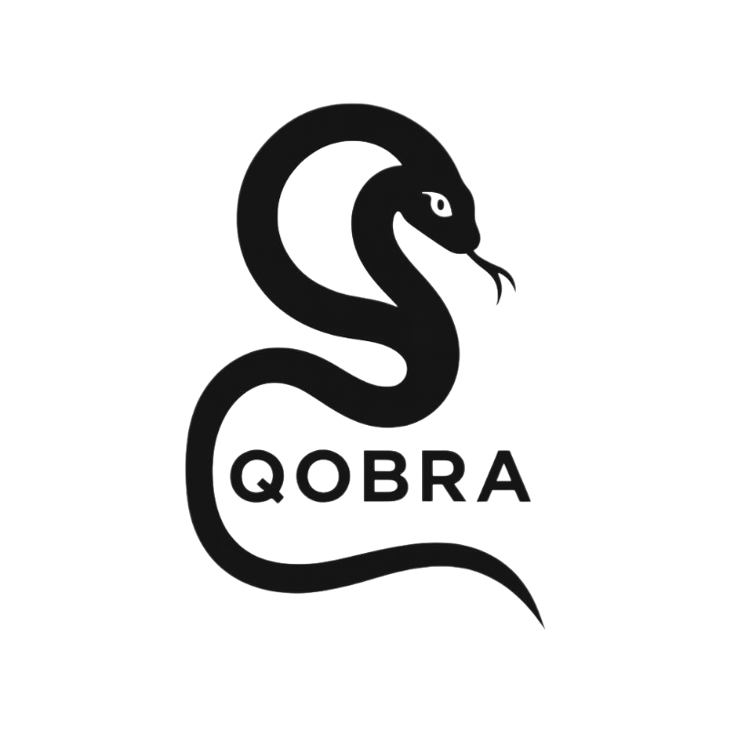

<div align="center">
  
</div>

[](https://colab.research.google.com/github/SamuelYueYu/QOBRA-1.0/blob/main/src/QOBRA_demo.ipynb)

# Abstract

We introduce a variational quantum autoencoder tailored *de novo* molecular design named **QOBRA** (Quantum Operator-Based Real-Amplitude autoencoder). QOBRA leverages quantum circuits for real-amplitude encoding and the SWAP test to estimate reconstruction and latent-space regularization errors during back-propagation. Adjoint encoder and decoder operators enable unitary transformations and a generative process that ensures accurate reconstruction as well as novelty, uniqueness, and validity of the generated samples.  We showcase the capabilities of QOBRA as applied to *de novo* design of Ca<sup>2+</sup>-, Mg<sup>2+</sup>-, and Zn<sup>2+</sup>-binding metalloproteins after training the generative model with a modest dataset.

## Table of Contents
1. [Overview](#overview)
2. [Features](#features)
3. [Installation](#installation)
4. [Usage](#usage)
5. [Project Structure](#project-structure)
6. [Algorithm Details](#algorithm-details)
7. [Training Data](#training-data)
8. [Results and Visualization](#results-and-visualization)
9. [Configuration](#configuration)
10. [Troubleshooting](#troubleshooting)
11. [Citation](#citation)
12. [Contact](#contact)
13. [License](#license)

## Overview

QOBRA (Quantum Operator-Based Real-Amplitude autoencoder) is a novel quantum machine learning framework for de novo molecular design. The system uses quantum autoencoders to learn meaningful representations of molecular sequences, enabling the generation of novel molecules with desired properties.

### Key Innovation
- **Quantum Autoencoder Architecture**: Encodes molecular sequences into quantum latent space using real-amplitude quantum circuits
- **Flexible Training Framework**: Adaptable to various molecular types and functional patterns
- **De Novo Generation**: Creates novel molecular designs from learned latent distributions
- **Property Preservation**: Maintains important functional patterns and motifs

### Current Demonstration
- **Protein Sequences**: Example implementation using metal-binding proteins (Ca²⁺, Mg²⁺, Zn²⁺)
- **Functional Motif Learning**: Captures and reproduces important binding sites and patterns

### Future Applications
- **Biomolecules**: Proteins, peptides, DNA/RNA sequences
- **Small Molecules**: Drug compounds, chemical libraries
- **Materials**: Polymer sequences, catalyst designs
- **General Sequence Design**: Any domain requiring pattern-based generation

## Features

- **Quantum Machine Learning**: Utilizes real-amplitude quantum circuits for molecular sequence encoding/decoding
- **Flexible Molecular Types**: General framework demonstrated on metal-binding proteins, extensible to any molecular sequence domain
- **Sequence Validation**: Comprehensive novelty, uniqueness, and validity checks
- **Visualization Tools**: Generates visualization scripts (current example: PyMOL for proteins)
- **Statistical Analysis**: Compares generated sequences with training data
- **Parallel Processing**: Efficient computation using multiprocessing
- **Comprehensive Output**: Detailed results, plots, and sequence files
- **Domain Agnostic**: Adaptable tokenization and encoding for different molecular representations

## Installation

### Prerequisites
- Python 3.11.5 or higher
- CUDA-compatible GPU (optional, for accelerated computation)

### Steps to Install

1. **Clone the repository**
```bash
git clone https://github.com/SamuelYueYu/QOBRA-1.0.git
cd QOBRA-1.0
```

2. **Create a virtual environment** (recommended)
```bash
python -m venv qobra_env
source qobra_env/bin/activate  # On Windows: qobra_env\Scripts\activate
```

3. **Install dependencies**
```bash
# Install from requirements.txt
pip install -r requirements.txt

# Or install manually
pip install biopython==1.85
pip install numpy==1.26.4
pip install qiskit==1.4.2
pip install qiskit-algorithms==0.3.1
pip install qiskit-machine-learning==0.8.2
pip install scipy==1.15.2
pip install matplotlib
pip install torch
```

4. **Extract training data** (if using provided datasets)
```bash
cd dataset
tar -xzf Ca_bind.tar.gz
tar -xzf Mg_bind.tar.gz
tar -xzf Zn_bind.tar.gz
```

## Usage

### Training Mode

Train the quantum autoencoder on molecular sequences:

```bash
cd src
python train.py [sequence_types] [num_qubits] [repetitions] [mode]
```

**Parameters:**
- `sequence_types`: Space-separated sequence types (current example: `Ca Mg Zn` for metal-binding proteins)
- `num_qubits`: Number of qubits for quantum circuits (e.g., `6`)
- `repetitions`: Number of ansatz repetitions (e.g., `1`)
- `mode`: `0` for training, `1` for inference

**Example:**
```bash
# Train on calcium-binding protein sequences with 6 qubits, 1 repetition
python train.py Ca 6 1 0
```

### Generation Mode

Generate de novo molecular sequences using trained model:

```bash
# Generate sequences using trained model
python gen.py Ca 6 1 1
```

### Batch Processing

Use the provided shell scripts for convenient batch processing (example scripts for protein sequences):

```bash
# Train and generate for calcium-binding protein sequences
bash run-Ca.sh

# Train and generate for magnesium-binding protein sequences
bash run-Mg.sh

# Train and generate for zinc-binding protein sequences
bash run-Zn.sh
```

### Jupyter Notebook Demo

For interactive exploration, use the provided Jupyter notebook:

```bash
cd src
jupyter notebook QOBRA_demo.ipynb
```

## Project Structure

```
QOBRA-1.0/
├── src/                          # Source code
│   ├── ansatz.py                 # Quantum circuit definitions
│   ├── coding.py                 # Molecular sequence encoding/decoding
│   ├── inputs.py                 # Data preprocessing
│   ├── model.py                  # Quantum models
│   ├── train.py                  # Training pipeline
│   ├── cost.py                   # Loss functions
│   ├── count.py                  # Token analysis
│   ├── gen.py                    # Sequence generation
│   ├── gen_func.py              # Generation utilities
│   └── QOBRA_demo.ipynb         # Interactive demo
├── dataset/                      # Example training datasets
│   ├── Ca_bind.tar.gz           # Example: Calcium-binding proteins
│   ├── Mg_bind.tar.gz           # Example: Magnesium-binding proteins
│   └── Zn_bind.tar.gz           # Example: Zinc-binding proteins
├── seq_to_struct/               # Structure prediction tools
├── assets/                      # Images and logos
├── run-*.sh                     # Batch processing scripts
├── requirements.txt             # Python dependencies
├── environment.yml              # Conda environment
└── README.md                    # This file
```

## Algorithm Details

### Quantum Autoencoder Architecture

1. **Encoder**: Transforms molecular sequences into quantum latent representations
   - Input feature map encodes classical sequences as quantum amplitudes
   - Parameterized ansatz compresses information into latent space

2. **Decoder**: Reconstructs sequences from latent representations
   - Inverse ansatz operation for sequence generation
   - Latent space sampling for de novo generation

3. **Training**: Maximum Mean Discrepancy (MMD) loss minimization
   - Matches encoded sequences to target Gaussian distribution
   - COBYLA optimizer for quantum parameter optimization

### Sequence Encoding (Current Protein Example)

- **Tokens**: Domain-specific vocabulary (example: 20 amino acids for proteins)
- **Functional Sites**: Important positions marked with '+' (e.g., binding sites, active sites)
- **Separators**: Multiple segments separated by ':' (e.g., protein chains, molecular domains)
- **Terminators**: Sequences ended with 'X'

### Extensibility to Other Molecular Domains

- **Small Molecules**: SMILES strings, molecular graphs
- **DNA/RNA**: Nucleotide sequences with structural annotations
- **Materials**: Monomer sequences, crystal structures
- **General**: Any tokenizable molecular representation

### Validation Criteria

Generated sequences are validated for:
- **Novelty**: Not present in training data
- **Uniqueness**: No duplicates in generated set
- **Validity**: Biologically plausible functional patterns
- **Chain Length**: Minimum length requirements met

## Example Training Data

The current demonstration uses curated protein datasets to showcase the framework's capabilities. The provided example datasets contain metal-binding proteins:

- **Calcium (Ca²⁺)**: ~12,800 sequences
- **Magnesium (Mg²⁺)**: ~16,500 sequences  
- **Zinc (Zn²⁺)**: ~19,500 sequences

Each sequence includes:
- Molecular identifier (e.g., PDB code for proteins)
- Sequence representation (amino acid sequence in this example)
- Functional annotations (binding sites, active sites, etc.)
- Structural organization (chain information, domains)

### Data Format Flexibility

The framework is designed to accommodate various molecular sequence formats:
- **Biomolecules**: FASTA sequences, structural annotations
- **Small Molecules**: SMILES, InChI, molecular fingerprints
- **Materials**: Compositional sequences, structural descriptors
- **Custom**: Any tokenizable molecular representation

## Results and Visualization

### Output Files

Training and generation produce comprehensive results:

- **Sequence Files**: Generated sequences in text format
- **PyMOL Scripts**: 3D visualization commands
- **Statistical Plots**: Distribution comparisons
- **Performance Metrics**: Novelty, uniqueness, validity scores
- **Training Curves**: Loss evolution during optimization

### Visualizations

- **Token Frequencies**: Amino acid distribution analysis
- **Functional Site Patterns**: Analysis of important motifs and sites
- **Sequence Length Distribution**: Length statistics
- **3D Structures**: PyMOL-based structure visualization

## Configuration

### Command Line Parameters

All parameters are passed via command line arguments:

```bash
python script.py [sequence_types] [num_qubits] [repetitions] [mode]
```

### Key Variables

- `dim_tot`: Total quantum state dimension (2^num_qubits)
- `max_len`: Maximum sequence length
- `cap`: Maximum training sequences (6000)
- `processes`: Number of parallel processes (6)
- `threshold`: Minimum chain length (4)

### Output Directories

Results are organized by sequence type and parameters:
```
{sequence_type}-{repetitions}/
├── Results-{sequence_type}-{repetitions}.txt
├── R-{sequence_type}-{repetitions}.txt
├── tokens-{sequence_type}.png
└── {seed}/
    ├── Bar-{seed}-{sequence_type}-{repetitions}.png
    └── Samples/
        └── {index}/
            ├── {index}.txt
            └── {index}.pml
```

## Troubleshooting

### Common Issues

1. **Memory Errors**: Reduce `cap` or `processes` values
2. **Slow Training**: Increase `processes` for parallel computation
3. **Poor Generation Quality**: Adjust `threshold` or training parameters
4. **Visualization Issues**: Ensure PyMOL is installed for 3D viewing

### Error Messages

- `FileNotFoundError`: Check data paths and extracted datasets
- `ParameterError`: Verify command line argument format
- `MemoryError`: Reduce batch size or quantum circuit dimensions

## Citation

If you use QOBRA in your research, please cite:

```bibtex
@article{yu2025qobra,
  title={QOBRA: A Quantum Operator-Based Autoencoder for De Novo Molecular Design},
  author={Yu, Yue and Calcagno, Francesco and Li, Haote and Batista, Victor},
  journal={arXiv preprint},
  year={2025}
}
```

## Contact

For questions, comments, or support, please contact:

**Yue Yu** (samuel.yu@yale.edu)
Yale University

**Victor S. Batista** (victor.batista@yale.edu)
Yale University

## License

This project is licensed under the MIT License - see the LICENSE file for details.

---

**Note**: This is research software. While we strive for accuracy and reliability, please validate all generated sequences experimentally before use in critical applications.
